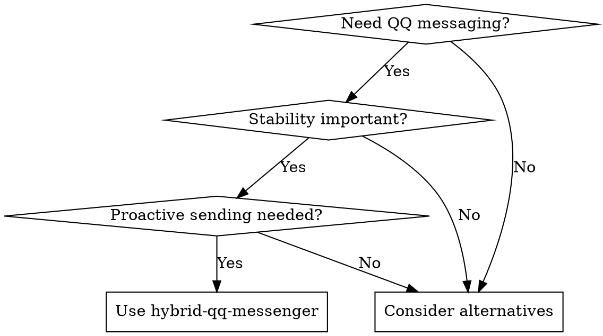

# Hybrid QQ Messenger Skill

## Overview

This skill provides comprehensive QQ messaging capabilities for OpenClaw through a hybrid architecture that separates message reception from proactive sending, ensuring maximum reliability and stability.

## When to Use



- **QQ Message Integration**: When OpenClaw needs to receive and send QQ messages
- **Proactive Notifications**: When sending system alerts, reminders, or updates via QQ
- **Conversation Management**: When handling natural QQ conversations with AI assistance
- **Developer Tools**: When integrating QQ notifications into development workflows
- **Personal Assistant**: When building AI-powered QQ personal assistants

**Do not use for**:
- Simple command-response patterns (use direct API calls instead)
- High-frequency message flooding (respect rate limits)
- Non-QQ messaging platforms (use appropriate adapters)

## Core Architecture

### Hybrid Design Pattern
```
Message Reception (NapCat) → OpenClaw AI → Proactive Sending (AstrBot)
```

The architecture separates concerns:
- **NapCat**: Specialized in stable WebSocket-based message reception
- **AstrBot**: Specialized in reliable REST API-based message sending
- **Plugin**: Coordinates between services and manages conversation state

## Configuration

### Required Services
- **NapCat**: Running on port 3001 with OneBot v11 WebSocket support
- **AstrBot**: Running on port 6185 with valid API credentials

### Plugin Configuration
```json
{
  "hybrid_mode": {
    "receiver": {
      "napcat_ws_url": "ws://localhost:3001",
      "enabled": true,
      "auto_reconnect": true
    },
    "sender": {
      "api_url": "http://localhost:6185/api/v1/im/message",
      "api_key": "YOUR_ASTRBOT_API_KEY",
      "target_qq": "YOUR_QQ_NUMBER",
      "enabled": true
    }
  }
}
```

## Usage Patterns

### Sending Proactive Messages

```python
import asyncio

async def send_qq_notifications():
    """Send proactive QQ messages using hybrid messenger"""
    
    # Import must be done in OpenClaw environment
    try:
        from main import send_message
        
        # Send system notification
        result = await send_message("🔔 System notification: Service started successfully")
        
        if result.get('status') == 'ok':
            print("✅ Message delivered successfully")
            print(f"Message ID: {result.get('message_id', 'N/A')}")
        else:
            print(f"❌ Message failed: {result.get('message', 'Unknown error')}")
            
        # Send to specific session with session management
        session_result = await send_message(
            "📅 Personal reminder: Meeting in 15 minutes", 
            session_id="private_YOUR_QQ_NUMBER"
        )
        
    except ImportError:
        print("⚠️  This code must run in OpenClaw environment with hybrid-qq-messenger plugin")
        print("💡 Install plugin and restart OpenClaw to enable QQ messaging")

# Run in OpenClaw environment
# asyncio.run(send_qq_notifications())
```

### Conversation Handling
Messages received via NapCat are automatically processed by OpenClaw AI, maintaining natural conversation flow without forced responses.

### Session Management
- Sessions automatically created on first message
- 5-minute timeout for inactive sessions
- Recent message history maintained for context

## Troubleshooting

### Common Issues

**NapCat Connection Problems**
- Verify NapCat service is running on port 3001
- Check WebSocket URL configuration
- Confirm OneBot v11 compatibility

**AstrBot API Errors**
- Validate API key and permissions
- Check target QQ number configuration
- Verify AstrBot service availability

**Plugin Loading Issues**
- Ensure plugin is in OpenClaw allow list
- Verify dependency installation
- Check OpenClaw configuration paths

## Performance Considerations

- **Auto-reconnection**: Automatic recovery from service interruptions
- **Message Retry**: Failed sends retry up to 3 times
- **Session Optimization**: Efficient memory management for active sessions
- **Error Recovery**: Graceful handling of service failures

## Best Practices

1. **Configuration Validation**: Always validate service configurations before deployment
2. **Rate Limiting**: Respect QQ platform rate limits for message sending
3. **Error Monitoring**: Implement monitoring for connection and delivery issues
4. **Session Cleanup**: Regular cleanup of expired sessions to prevent memory leaks
5. **Backup Communication**: Consider alternative notification channels for critical alerts

## Quick Reference

| Task | Command | Notes |
|------|---------|-------|
| **Installation Check** | `python tests/check_installation.py` | Verify all dependencies and services |
| **Basic Test** | `python tests/quick_test.py` | Test core messaging functionality |
| **Full System Test** | `python tests/test_system.py` | Complete end-to-end validation |
| **Send Message** | `from main import send_message` | Use in OpenClaw environment |
| **Check Status** | `python -c "from main import send_message; import asyncio; asyncio.run(send_message('test'))"` | Quick functionality test |

## Quick Start

### Installation Verification
```bash
python tests/check_installation.py
```

### Basic Functionality Test
```bash
python tests/quick_test.py
```

### Full System Test
```bash
python tests/test_system.py
```

---

**Skill Version**: 1.0.0  
**Compatibility**: OpenClaw with NapCat and AstrBot services  
**Status**: Production Ready  
**Last Updated**: 2026-03-29